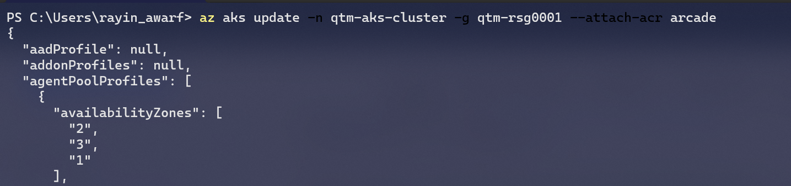

## Rancher configuration

```s
sudo apt-get update -y
reboot
sudo apt-get install docker.io
mkdir /var/lib/rancher
docker run -d --name rancher -v /var/lib/rancher:/var/lib/rancher--restart=unless-stopped -p 80:80 -p 443:443 --privileged rancher/rancher
docker logs container-id  2>&1 | grep "Bootstrap Password:"
```

## TLS and key-vault


```
az group create --name myResourceGroupSecureWeb --location eastasia
az keyvault create --resource-group myResourceGroupSecureWeb  --name test-my-keyvault-tls  --enabled-for-deployment
```

```
az keyvault certificate get-default-policy
save it to policy.json

```
az --% keyvault certificate create --vault-name test-my-keyvault-tls --name mycert --policy @policy.json
{
  "cancellationRequested": false,
  "csr": "MIICrjCCAZYCAQAwHjEcMBoGA1UEAxMTQ0xJR2V0RGVmYXVsdFBvbGljeTCCASIwDQYJKoZIhvcNAQEBBQADggEPADCCAQoCggEBANsYNg+WcJiROt9g/DtGhStJK1S6inB3ZbbRUyK0E0Mg3yv2W7tWENUR34kqzaiuOzJLWFt0jTIZonzDoJeVIv1wI1VI8QzcG7+Tn6zp/fjElyVqSpvrZAFzeXDOmcw0+aceedUu3B1SU0ZcyB32DVUZ/ZP1Bh5PdKylUoQQcx/ZDc6PV/UbBv65n1jpMo0pZUe/DeVlZraRc+jWXtd2MxJafYpDaWsuAMYR3sCTxqNBAgKx+jIAtaR8Dv1dKMlRB7w2N8RNmSmTYqt2eetuRgxBZBLasfwCsnEWarZzGwzpoRIZdEUAQP3D3kSHKCQww26I+TKUvp+n+THLi7x0ym0CAwEAAaBLMEkGCSqGSIb3DQEJDjE8MDowDgYDVR0PAQH/BAQDAgG+MB0GA1UdJQQWMBQGCCsGAQUFBwMBBggrBgEFBQcDAjAJBgNVHRMEAjAAMA0GCSqGSIb3DQEBCwUAA4IBAQBPGqDhNX6C2C3GJGx1aZAK5ECGxUEFvklvJ1K6odXwJUrLGIILm7xxyPsQ8a3kvO+Mr997+5PxdYma1Ei1ag/yjHC9IFwJ0Ft2MT/zmPgBQtmDyn97DI4t6CxsNtAxXt+Y43Lv0ZMoypaF12u6ADfNlI8I6//lGHw0PLtQTU2jp0G8C2KOJCmr2pdZjjB3zOEqItSLBWz6g642+TS81K2wAt7p0suJeB4lZDU7K8vg8gW2pE0QqOHZsVRJXz1a9bwpMpKqJpmrLbdDGPS3BTsTG+I67+MFhCY7GuaEGtZ6XtnSCEtz34sOW8McX/o8We2+W/k9oeXzKUxMW2Vhm4QK",
  "error": null,
  "id": "https://test-my-keyvault-tls.vault.azure.net/certificates/mycert/pending",
  "issuerParameters": {
    "certificateTransparency": null,
    "certificateType": null,
    "name": "Self"
  },
  "name": "mycert",
  "requestId": "5345f6867a7045a8a29c2a6db02de1d4",
  "status": "completed",
  "statusDetails": null,
  "target": "https://test-my-keyvault-tls.vault.azure.net/certificates/mycert"
}


## AKS
